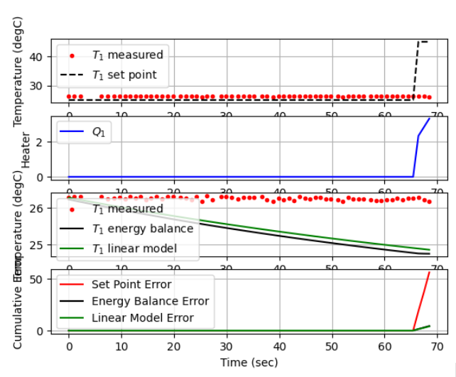
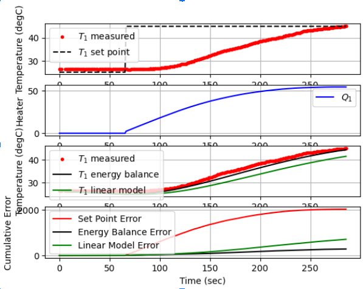

## Kelompok 1 Mata Kuliah Mikrokontroler A081 ###
---
### Anggota Kelompok : ### 
1. Syukur Iman Attaqwa - 20081010026
2. 
3.
4. 

## Pembahasan

#### A. Algoritma Dessicion Tree Regeresor ####

 

#### B. Hasil PID Control iTC Lab #####
1. Awal Mulai
    

2. Waktu Mencapai Set Point 
   

3. Hasil Akhir 
       

