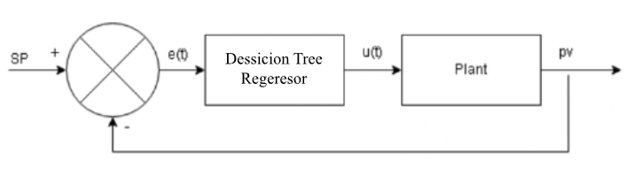
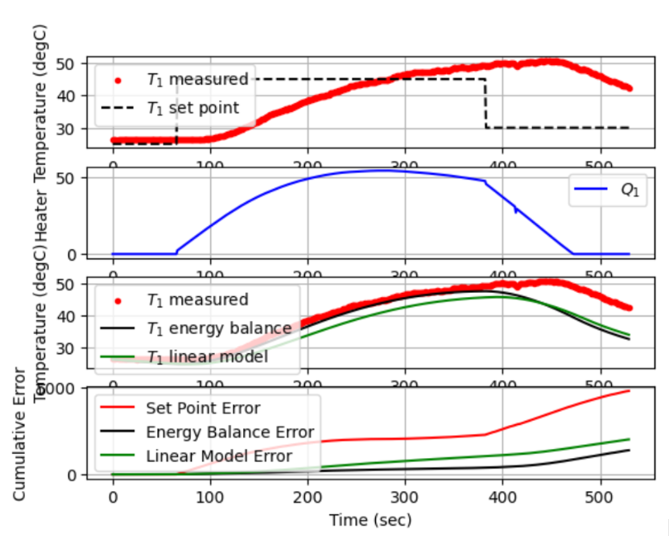

## Kelompok 1 Mata Kuliah Mikrokontroler A081 ###
---
### Anggota Kelompok : ### 
1. Syukur Iman Attaqwa - 20081010026
2. 
3.
4. 

# Pengenalan
Tujuan dari proyek ini adalah untuk mencoba metode yang berbeda untuk kontrol suhu yaitu menggunakan Algoritma Dessicion Tree Regeresor untuk menentukan kontrol PID pada kit ITCLab .

## Asitektur 
Arsitektur sistem kontrol menggunakan DessicionTreeRegeresor untuk ITCLab Kit ditunjukkan pada gambar di bawah ini.

  

# Hasil PID Control iTC Lab #####
## Bagian Awal 
  
## Bagian Waktu Mencapai Set Point 
   

## Bagian Akhir 
     

